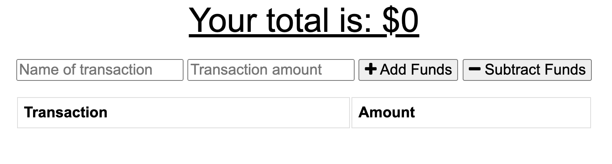

# TechBlog 14_MVC

[](https://opensource.org/licenses/MIT)

## Description

For this assignment I was tasked with creating a fitness tracker app. I did this by creating a mongo database and mongoose schema with Express to handle the routes.

## Table of Contents

- [Deployment](#deployment)
- [User Story](#user-story)
- [Mock-Up](#mock-up)
- [Acceptance Criteria](#acceptance-criteria)
- [License](#license)
- [Contribute](#contribute)

## Deployment

The app can be found at this link:
https://damp-cove-83188.herokuapp.com/?id=60f60df50b56150015cd58f3

## User Story

```md
As a user, I want to be able to view create and track daily workouts. I want to be able to log multiple exercises in a workout on a given day. I should also be able to track the name, type, weight, sets, reps, and duration of exercise. If the exercise is a cardio exercise, I should be able to track my distance traveled.
```

## Mock-Up

The following image shows a screenshot of the deployed application.



## Acceptance Criteria

```md
When the user loads the page, they should be given the option to create a new workout or continue with their last workout.

The user should be able to:

- Add exercises to the most recent workout plan.

- Add new exercises to a new workout plan.

- View the combined weight of multiple exercises from the past seven workouts on the `stats` page.

- View the total duration of each workout from the past seven workouts on the `stats` page.
```

## License

Licensed under the [MIT](https://choosealicense.com/licenses/mit/)

    MIT License

    Copyright (c) [2021] [Connor Gannaway]

    Permission is hereby granted, free of charge, to any person obtaining a copy
    of this software and associated documentation files (the "Software"), to deal
    in the Software without restriction, including without limitation the rights
    to use, copy, modify, merge, publish, distribute, sublicense, and/or sell
    copies of the Software, and to permit persons to whom the Software is
    furnished to do so, subject to the following conditions:

    The above copyright notice and this permission notice shall be included in all
    copies or substantial portions of the Software.

    THE SOFTWARE IS PROVIDED "AS IS", WITHOUT WARRANTY OF ANY KIND, EXPRESS OR
    IMPLIED, INCLUDING BUT NOT LIMITED TO THE WARRANTIES OF MERCHANTABILITY,
    FITNESS FOR A PARTICULAR PURPOSE AND NONINFRINGEMENT. IN NO EVENT SHALL THE
    AUTHORS OR COPYRIGHT HOLDERS BE LIABLE FOR ANY CLAIM, DAMAGES OR OTHER
    LIABILITY, WHETHER IN AN ACTION OF CONTRACT, TORT OR OTHERWISE, ARISING FROM,
    OUT OF OR IN CONNECTION WITH THE SOFTWARE OR THE USE OR OTHER DEALINGS IN THE
    SOFTWARE.

## Contribute

[](code_of_conduct.md)

Please give me credit! This is not an original idea but an original way to create this.

## Questions

If you have any questions regarding this application please contact me at my GitHub here: (github.com/gannacon)

Or Send me an email: cwgannaway@gmail.com

---

© 2021 Connor Gannaway. All Rights Reserved.
